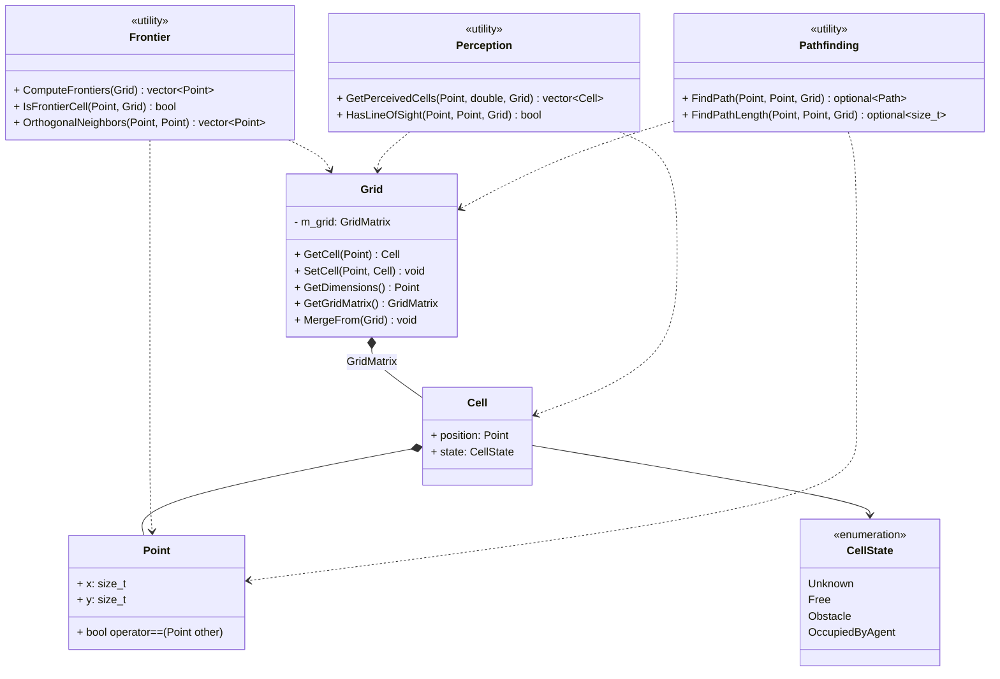
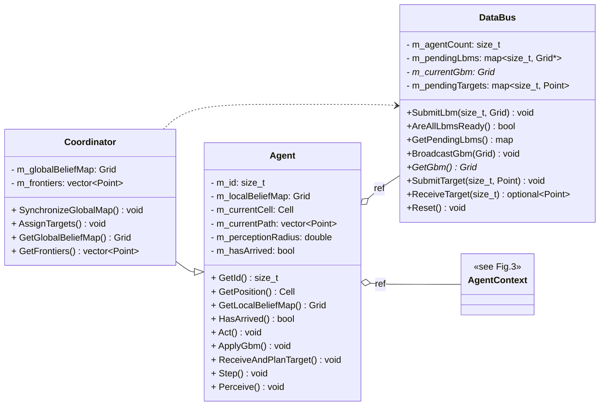
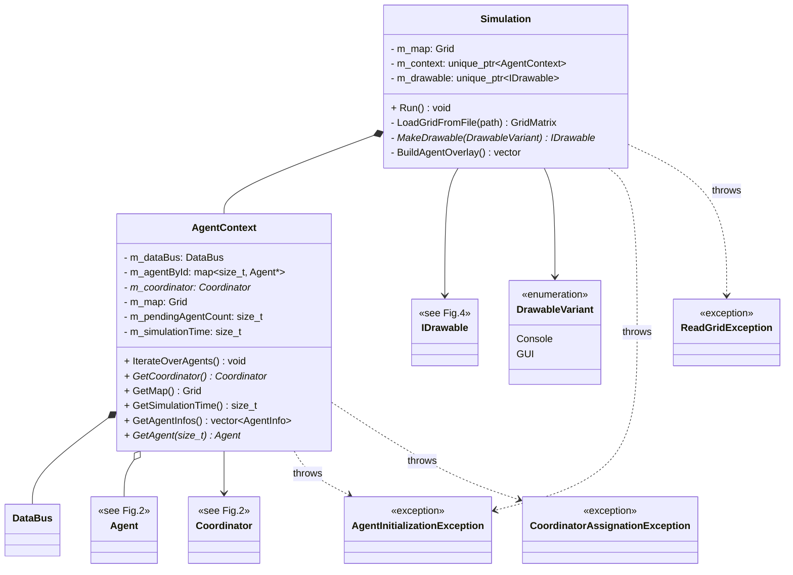
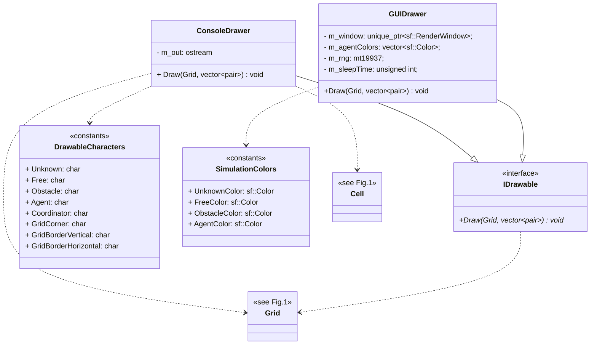

## Диаграмма классов

### Модель среды

```mermaid
classDiagram
    class Point {
        + x: size_t
        + y: size_t
        
        + bool operator==(Point other)
    }

    class CellState {
        <<enumeration>>
        Unknown
        Free
        Obstacle
        OccupiedByAgent
    }

    class Cell {
        + position: Point
        + state: CellState
    }

    class Grid {
        - m_grid: GridMatrix
        
        + GetCell(Point) Cell
        + SetCell(Point, Cell) void
        + GetDimensions() Point
        + GetGridMatrix() GridMatrix
        + MergeFrom(Grid) void
    }

    class Frontier {
        <<utility>>
        + ComputeFrontiers(Grid) vector~Point~
        + IsFrontierCell(Point, Grid) bool
        + OrthogonalNeighbors(Point, Point) vector~Point~
    }

    class Perception {
        <<utility>>
        + GetPerceivedCells(Point, double, Grid) vector~Cell~
        + HasLineOfSight(Point, Point, Grid) bool
    }

    class Pathfinding {
        <<utility>>
        + FindPath(Point, Point, Grid) optional~Path~
        + FindPathLength(Point, Point, Grid) optional~size_t~
    }

    Cell *-- Point
    Cell --> CellState
    Grid *-- Cell : GridMatrix

    Frontier ..> Grid
    Frontier ..> Point
    Perception ..> Grid
    Perception ..> Cell
    Pathfinding ..> Grid
    Pathfinding ..> Point
```

### Агентная система

```mermaid
classDiagram
    direction LR
    class DataBus {
        - m_agentCount: size_t
        - m_pendingLbms: map~size_t, Grid*~
        - m_currentGbm: Grid*
        - m_pendingTargets: map~size_t, Point~
        
        +SubmitLbm(size_t, Grid) void
        +AreAllLbmsReady() bool
        +GetPendingLbms() map
        +BroadcastGbm(Grid) void
        +GetGbm() Grid*
        +SubmitTarget(size_t, Point) void
        +ReceiveTarget(size_t) optional~Point~
        +Reset() void
    }

    class Agent {
        - m_id: size_t
        - m_localBeliefMap: Grid
        - m_currentCell: Cell
        - m_currentPath: vector~Point~
        - m_perceptionRadius: double
        - m_hasArrived: bool
        
        + GetId() size_t
        + GetPosition() Cell
        + GetLocalBeliefMap() Grid
        + HasArrived() bool
        + Act() void
        + ApplyGbm() void
        + ReceiveAndPlanTarget() void
        + Step() void
        + Perceive() void
    }

    class Coordinator {
        - m_globalBeliefMap: Grid
        - m_frontiers: vector~Point~
        
        + SynchronizeGlobalMap() void
        + AssignTargets() void
        + GetGlobalBeliefMap() Grid
        + GetFrontiers() vector~Point~
    }

    class AgentContext {
        <<see Fig.3>>
    }

    Coordinator --|> Agent
    Agent o-- DataBus : ref
    Agent o-- AgentContext : ref
    Coordinator ..> DataBus
```

### Управление симуляцией

```mermaid
classDiagram
    class AgentContext {
        - m_dataBus: DataBus 
        - m_agentById: map~size_t, Agent*~
        - m_coordinator: Coordinator*
        - m_map: Grid
        - m_pendingAgentCount: size_t
        - m_simulationTime: size_t
        
        + IterateOverAgents() void
        + GetCoordinator() Coordinator*
        + GetMap() Grid
        + GetSimulationTime() size_t
        + GetAgentInfos() vector~AgentInfo~
        + GetAgent(size_t) Agent*
    }

    class Simulation {
        - m_map: Grid
        - m_context: unique_ptr~AgentContext~
        - m_drawable: unique_ptr~IDrawable~
        + Run() void
        - LoadGridFromFile(path) GridMatrix
        - MakeDrawable(DrawableVariant) IDrawable*
        - BuildAgentOverlay() vector
    }

    class DrawableVariant {
        <<enumeration>>
        Console
        GUI
    }

    class AgentInitializationException {
        <<exception>>
    }

    class CoordinatorAssignationException {
        <<exception>>
    }

    class ReadGridException {
        <<exception>>
    }

    class Agent {
        <<see Fig.2>>
    }

    class Coordinator {
        <<see Fig.2>>
    }

    class IDrawable {
        <<see Fig.4>>
    }

    Simulation *-- AgentContext
    Simulation --> IDrawable
    Simulation --> DrawableVariant
    AgentContext *-- DataBus
    AgentContext o-- Agent
    AgentContext --> Coordinator

    Simulation ..> AgentInitializationException : throws
    Simulation ..> ReadGridException : throws
    AgentContext ..> AgentInitializationException : throws
    AgentContext ..> CoordinatorAssignationException : throws
```

### Слой визуализации

```mermaid
classDiagram
    class IDrawable {
        <<interface>>
        +Draw(Grid, vector~pair~)* void
    }

    class ConsoleDrawer {
        - m_out: ostream
        
        + Draw(Grid, vector~pair~) void
    }

    class GUIDrawer {
        - m_window: unique_ptr~sf::RenderWindow~;
        - m_agentColors: vector~sf::Color~;
        - m_rng: mt19937;
        - m_sleepTime: unsigned int;
        
        +Draw(Grid, vector~pair~) void
    }

    class DrawableCharacters {
        <<constants>>
        + Unknown: char 
        + Free: char 
        + Obstacle: char 
        + Agent: char
        + Coordinator: char 
        + GridCorner: char
        + GridBorderVertical: char 
        + GridBorderHorizontal: char
    }
    
    class SimulationColors {
        <<constants>>
        + UnknownColor: sf::Color
        + FreeColor: sf::Color
        + ObstacleColor: sf::Color
        + AgentColor: sf::Color
    }

    class Grid {
        <<see Fig.1>>
    }

    class Cell {
        <<see Fig.1>>
    }

    ConsoleDrawer --|> IDrawable
    GUIDrawer --|> IDrawable
    GUIDrawer ..> SimulationColors
    ConsoleDrawer ..> DrawableCharacters
    ConsoleDrawer ..> Grid
    ConsoleDrawer ..> Cell
    IDrawable ..> Grid

```
